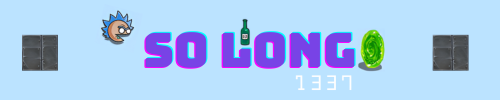

# So_Long

A simple 2D game created as part of the 42 curriculum where you control a character who needs to collect all items and reach an exit to win. Built using the MiniLibX graphics library, this project focuses on window management, event handling, and basic game mechanics.


## Game Overview

In "So_Long", you navigate a character through a map filled with collectibles, walls, and an exit. The objective is to:



- Collect all collectibles scattered throughout the map
- Reach the exit once all collectibles are gathered
- Avoid unnecessary moves to achieve the best possible score

## Requirements

- MiniLibX library
- X11 development libraries (xorg, xorg-dev, X11 and XShm extensions)
- GCC compiler
- Make

## Installation

### 1. Clone this repository
```bash
git clone https://github.com/albardii/so_long.git
cd so_long
```

### 2. Install MiniLibX dependencies
For Debian/Ubuntu:
```bash
sudo apt-get update
sudo apt-get install gcc make xorg libxext-dev libbsd-dev
```

For Fedora/CentOS:
```bash
sudo dnf install gcc make xorg-x11-server-devel libXext-devel
```

For macOS (with Homebrew):
```bash
brew install xquartz
```

### 3. Compile the game
The Makefile will handle the compilation of the MiniLibX library and the game:
```bash
make
```

## How to Play

1. Launch the game with a valid map file:
```bash
./so_long maps/map.ber
```

2. Controls:
   - **W**: Move up
   - **A**: Move left
   - **S**: Move down
   - **D**: Move right
   - **ESC**: Quit the game

3. Game Rules:
   - The player can move in four directions: up, down, left, and right
   - The player cannot move through walls
   - Each movement counts as one step and is displayed in the terminal
   - Collect all collectibles before reaching the exit
   - The game ends when all collectibles are collected and the player reaches the exit

## Map Format

Maps are defined in `.ber` files with the following symbols:
- **1**: Wall
- **0**: Empty space
- **P**: Player starting position (only one allowed)
- **C**: Collectible
- **E**: Exit (only one allowed)

Example of a valid map:
```
1111111111111
10010000000C1
1000011111001
1P0011E000001
1111111111111
```

Map requirements:
- Must be rectangular
- Must be surrounded by walls ('1')
- Must contain exactly one player ('P')
- Must contain exactly one exit ('E')
- Must contain at least one collectible ('C')
- Must have a valid path allowing the player to collect all collectibles and reach the exit

## Error Handling

The game performs several checks on the provided map:
- File extension must be `.ber`
- Map must be rectangular
- Map must be enclosed by walls
- Map must contain exactly one player and one exit
- Map must contain at least one collectible
- Map must have a valid path to all collectibles and the exit

## Project Structure

```
so_long/
├── assets/             # Game assets and sprites
├── includes/           # Header files
├── libs/               # Libraries (libft, etc.)
├── maps/               # Map files
├── srcs/               # Source code
│   ├── game/           # Game logic
│   ├── map/            # Map parsing and validation
│   ├── graphics/       # Rendering functions
│   └── utils/          # Utility functions
├── Makefile            # Build system
└── README.md           # Project documentation
```

## Implementation Details

- Written in C according to the 42 Norm
- Memory management with proper allocation/deallocation
- Error handling for invalid maps and system failures
- Floodfill algorithm for path validation
- Key event handling through MiniLibX hooks

## Contact

If you have any questions or suggestions about this project, feel free to contact me:
- GitHub: [@elbardii](https://github.com/elbardii)
- 42 Intra: [ismail](https://profile.intra.42.fr/users/isel-bar)

## License

This project is licensed under the terms of the MIT license.
